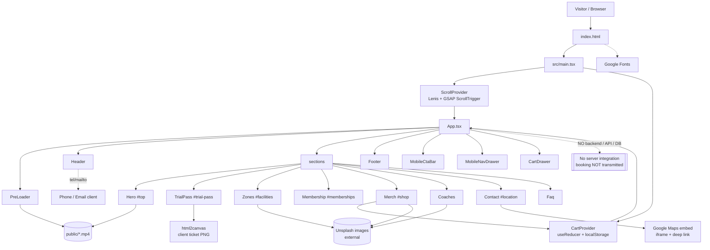

# PROJECT CONTEXT REPORT — REBORN FITNESS

**Report generated:** 2026-10-09
**Repository:** `C:\Users\ADMIN\OneDrive\Desktop\reborn` (`reborn-fitness` v0.1.0)
**Git remote:** `https://github.com/Deepak06-v/reborn_fitness.git` (branch `main`, 5 commits)
**Analyst scope:** Full source inspection of `src/`, config, public assets, docs, and build output. Commands were actually run (results reported in §11).

> Evidence labels used throughout: **Verified** = read directly from source/command output; **Inferred** = reasonable conclusion from evidence; **Potential Issue** = plausible defect not yet reproduced; **Unknown** = cannot be determined from the repo.

---

## QUICK REFERENCE (read this first)

| Question | Answer |
|---|---|
| What is it? | A **single-page marketing/advertising website** for a fictional 24/7 gym brand, "REBORN FITNESS". |
| Framework | **React 18.3.1 + TypeScript 5.5** on **Vite 5.4** |
| Styling | **Tailwind CSS 3.4** with RGB-channel CSS custom properties |
| Animation | **GSAP 3.12 + ScrollTrigger**, **Lenis** smooth scroll (desktop only) |
| Router | **None.** Anchor-based one-page sections (`#trial-pass`, `#facilities`, …) |
| State | React Context: `CartProvider` (useReducer + localStorage), `ScrollProvider` (Lenis instance) |
| Backend / API / DB | **None.** No server, no fetch, no database. Booking is simulated client-side. |
| Entry point | `index.html` → `src/main.tsx` → `src/App.tsx` |
| Sections | PreLoader, Hero, TrialPass, Zones, Membership, Merch, Coaches, Contact, FAQ |
| Booking works? | **UI only** — produces a client-generated pass; **no data is sent anywhere** (`src/components/sections/TrialPass.tsx:142-173`). |
| Checkout works? | **No** — "Proceed to checkout" just closes the drawer (`src/components/cart/CartDrawer.tsx:184-191`). |
| Tests | **None** — no test runner, no test script, no CI. |
| Build status | **Passing** — `npm run lint` clean (0 warnings), `npm run build` succeeds. |
| Biggest issues | Missing `logo.svg` (favicon 404 + broken fallbacks); ~80 MB of public video assets, incl. a 34.5 MB preloader video and duplicated unused files; no real form submission; map shows the wrong city; several dead files/deps. |

---

## 1. Executive Summary

REBORN FITNESS is a **mobile-first, motion-driven, single-page marketing website** for a (fictional) premium 24/7 "biometric performance gym". It is a **pure frontend application** built with Vite + React + TypeScript, styled with Tailwind CSS, and animated with GSAP ScrollTrigger and Lenis. It contains **no backend, database, API client, authentication, or payment integration** (Verified).

Its purpose is **advertising and lead generation**: it presents the facility, membership tiers, merch, coaches, location, and FAQs, and it funnels visitors toward a "1-Day VIP Pass" booking form. The form is a **client-side demo**: it validates input and generates a downloadable ticket but does **not transmit** the lead to anyone (the code contains only commented-out integration placeholders for EmailJS/Formspree/Zapier). Merch has a cart drawer that persists to `localStorage` but has **no checkout**. Membership CTAs merely scroll back to the trial-pass form.

Architecturally the codebase is small, clean, and consistent: 9 section components, 5 UI primitives, 4 layout components, 3 animation helpers, 2 context providers, 2 hooks, and 7 static data modules. TypeScript is strict; lint passes with zero warnings; production build succeeds. The main weaknesses are **asset weight** (≈80 MB of raw video in `public/`), **non-functional conversion endpoints** (no lead delivery, no checkout), and **broken asset references** (`logo.svg` is referenced but does not exist).

The historical `docs/superpowers/` and `.superpowers/` folders describe an earlier, differently-named design ("RAW HEAVY METAL GYM") with a proposed Vercel deployment and `VITE_*` env vars. Those plans/specs do **not** match the current implementation and none of the proposed backend integrations, env vars, or `vercel.json` were ever added (Verified — see §16).

---

## 2. Product Purpose and Business Workflows

### 2.1 Business model (Inferred from copy + features)
- **Brand:** REBORN FITNESS — "District 04 Performance Campus", 1280 Foundry Street, Bay 7, Austin, TX 78702 (`src/data/site.ts:10-19`).
- **Positioning:** high-end, "instrumented"/telemetry-driven strength & recovery gym, open 24/7 with "biometric access".
- **Monetisation shown in the UI:** three membership tiers (Day Pass $25, Athlete Monthly $89, Elite Performance $149 — `src/data/plans.ts`) plus a small merch/fuel shop. No prices are collected anywhere.
- **Target audience (Inferred):** serious lifters, powerlifters, strength/conditioning athletes who value data, recovery and 24/7 access. Copy is terse and technical.

### 2.2 Primary customer journey
1. **Landing** → full-screen video `PreLoader` plays a logo animation, then fades out (`PreLoader.tsx:33-82`; auto-exits after a 5 s safety timeout).
2. **Hero** (`#top`) → staggered headline, simulated live telemetry, dual CTAs ("Claim 1-Day VIP Pass" → `#trial-pass`, "Explore Telemetry & Zones" → `#facilities`).
3. **Trial booking** (`#trial-pass`) → pick goal → day/time window → enter name/phone/email → optional coach → submit → simulated 2 s delay → modal "boarding pass" with reference + entry code + barcode; download as PNG via `html2canvas` (`TrialPass.tsx:91-109`).
4. **Exploration** → Zones, Memberships, Merch, Coaches, Location, FAQ.
5. **Secondary micro-conversions** → `tel:`/`mailto:` links, copy address, open Google Maps, add merch to cart, book with a specific coach.

### 2.3 Lead-generation mechanisms present
| Mechanism | Implemented? | Evidence |
|---|---|---|
| Trial-pass form with validation | UI yes, delivery **no** | `TrialPass.tsx:127-174` |
| Client-generated ticket + PNG download | Yes (local only) | `TrialPass.tsx:91-109`, `416-541` |
| Click-to-call / email | Yes | `data/site.ts:15-18`, `Contact.tsx:51-69` |
| Google Maps deep link | Yes | `Contact.tsx:106-115` |
| Newsletter signup | **Not present** | — |
| Payment / membership signup | **Not present** (CTAs scroll to trial form) | `Membership.tsx:128-136` |
| Merch checkout | **Not present** (button closes drawer) | `CartDrawer.tsx:184-191` |
| Analytics / conversion tracking | **Not present** | no GA/Plausible/etc. |

### 2.4 Complete vs partial vs static
- **Complete (functional as a static site):** navigation, smooth scrolling, section reveals, mobile drawer, FAQ accordion, zones tab switcher, membership billing toggle, cart add/quantity/persist, copy address, map deep link, responsive layout.
- **Partial / simulated:** trial-pass booking (no transmission), live occupancy counter (random simulation, `Hero.tsx:37-45`), "24/7" status (hardcoded label).
- **Static-only:** testimonials (absent), gallery (absent), checkout, membership purchase, payment.

---

## 3. Verified Technology Stack

From `package.json`, `vite.config.ts`, `tsconfig.json`, and source imports (Verified):

| Layer | Technology | Version | Where |
|---|---|---|---|
| UI library | React | ^18.3.1 | `package.json:19` |
| DOM renderer | react-dom | ^18.3.1 | `package.json:20` |
| Language | TypeScript | ^5.5.0 | `package.json:36` |
| Build tool | Vite | ^5.4.0 (built with 5.4.21) | `package.json:37` |
| React plugin | @vitejs/plugin-react | ^4.3.1 | `package.json:30` |
| Styling | Tailwind CSS | ^3.4.19 | `package.json:35` |
| PostCSS | autoprefixer | ^10.6.1 | `package.json:31` |
| Animation | gsap | ^3.12.5 (ScrollTrigger) | `package.json:15` |
| Smooth scroll | lenis | ^1.1.0 | `package.json:17` |
| Icons | lucide-react | ^0.469.0 | `package.json:18` |
| Class utils | clsx ^2.1.1, tailwind-merge ^2.5.0 | | `package.json:14,22`; `src/lib/utils.ts` |
| Ticket export | html2canvas | ^1.4.1 | `package.json:16`; `TrialPass.tsx:2` |
| QR (declared) | react-qr-code | ^2.2.0 | `package.json:21` — **never imported (unused)** |
| Lint | eslint 8.57 + @typescript-eslint 7.18 + react-hooks + react-refresh | | `.eslintrc.cjs` |
| Types | @types/node, @types/react, @types/react-dom | | `package.json:25-27` |

**TypeScript config** (`tsconfig.json`): `strict: true`, `noUnusedLocals: true`, `noUnusedParameters: true`, `noFallthroughCasesInSwitch: true`, `jsx: react-jsx`, `moduleResolution: bundler`, target ES2020. A second config `tsconfig.node.json` covers `vite.config.ts` and `tailwind.config.ts`.

**Build chunking** (`vite.config.ts:12-20`): manual vendor chunks `vendor-react`, `vendor-motion` (gsap+lenis), `vendor-icons` (lucide-react); output `dist`, target `es2020`.

**No backend runtime, no server framework, no database driver, no ORM, no auth library, no HTTP client** appears in dependencies or source (Verified by grep for `fetch(`, `axios`, `process.env`, `import.meta.env` — only commented examples in `TrialPass.tsx` and `localStorage` usage in `CartContext.tsx`).

---

## 4. Repository and Folder Structure

```
reborn/
├── index.html                  # HTML shell, meta tags, favicon (/logo.svg — missing), mounts #root
├── package.json                # deps + scripts (dev/build/preview/lint)
├── package-lock.json
├── vite.config.ts              # React plugin + manualChunks
├── tailwind.config.ts          # tokens → Tailwind theme, fonts, glows, keyframes
├── postcss.config.js           # tailwind + autoprefixer
├── tsconfig.json / tsconfig.node.json
├── .eslintrc.cjs
├── .gitignore                  # ignores dist, node_modules, .env*, .superpowers, vercel
├── README.md                   # project overview (partially STALE — see §7.1)
├── public/                     # static assets copied verbatim to dist
│   ├── logo.png                # used logo
│   ├── logo.svg                # MISSING (referenced as favicon + onError fallback)
│   ├── exercise-bg-desktop.mp4 # used (Hero, desktop)
│   ├── exercise-bg-mobile.mp4  # used (Hero, mobile)
│   ├── exercise-bg.mp4         # UNUSED duplicate of exercise-bg-desktop
│   ├── logo-anim-desktop.mp4   # used (PreLoader, desktop) — ~34.5 MB
│   ├── logo-anim-mobile.mp4    # used (PreLoader, mobile)
│   └── logo-anim.mp4           # UNUSED duplicate of logo-anim-desktop
├── dist/                       # build output (gitignored)
├── docs/superpowers/           # EARLIER design spec + plan ("RAW HEAVY METAL GYM") — historical
│   ├── plans/2026-10-02-raw-heavy-metal-gym.md
│   └── specs/2026-10-02-raw-heavy-metal-gym-design.md
├── .superpowers/sdd/…          # SDD ledger + review diffs (gitignored scratch)
└── src/
    ├── main.tsx                # entry: StrictMode → ScrollProvider → CartProvider → App
    ├── App.tsx                 # composes all sections + layout chrome
    ├── vite-env.d.ts
    ├── components/
    │   ├── animations/         # Counter (UNUSED), ScrollReveal, StaggerText
    │   ├── cart/               # CartDrawer
    │   ├── layout/             # Header, Footer, MobileCtaBar, MobileNavDrawer
    │   ├── sections/           # PreLoader, Hero, TrialPass, Zones, Membership,
    │   │                       #   Merch, Coaches, Contact, Faq
    │   └── ui/                 # Badge (UNUSED), Button, Card, Modal, SectionHeading
    ├── context/                # CartContext.tsx, ScrollContext.ts
    ├── data/                   # site, booking, coaches, faqs, plans, products, zones (static)
    ├── hooks/                  # useCart.ts, useScrollTo.ts
    ├── lib/                    # utils.ts (cn)
    ├── providers/              # ScrollProvider.tsx
    ├── styles/                 # globals.css (tokens, components, utilities, print)
    └── types/                  # index.ts (shared interfaces)
```

**Directory purposes**
- `components/ui` — reusable, style-only primitives (no business logic).
- `components/layout` — persistent chrome (header, footer, drawers, mobile CTA).
- `components/sections` — one file per on-page section, mostly consuming `data/*`.
- `components/animations` — GSAP wrapper components.
- `context` + `providers` — global Cart state and the Lenis/ScrollTrigger scroll engine.
- `data` — all marketing content as typed arrays/objects (the de-facto CMS).
- `lib` — the `cn()` class-merging helper.

---

## 5. Frontend Architecture

### 5.1 Rendering lifecycle
`index.html` loads `/src/main.tsx`, which renders (Verified `main.tsx:8-16`):
```
StrictMode → ScrollProvider (Lenis + GSAP ticker) → CartProvider (reducer + localStorage) → App
```
`App.tsx` holds three pieces of local state — `menuOpen`, `requestedCoachId`, `preloaderDone` — and renders `<PreLoader>` (until done), the skip link, `<Header>`, `<main>` with 8 sections, `<Footer>`, `<MobileCtaBar>`, `<MobileNavDrawer>`, and `<CartDrawer>`.

### 5.2 Scroll engine (`src/providers/ScrollProvider.tsx`)
- Registers ScrollTrigger once (`:7`).
- **Skips Lenis entirely** when `prefers-reduced-motion: reduce` (`:20`) **or** when the device is touch/mobile (`window.innerWidth < 768` OR touch events OR `maxTouchPoints > 0`, `:23-30`). This is a deliberate "zero-lag mobile" decision; mobile uses native scrolling.
- When active: `new Lenis({ duration: 1.1, smoothWheel: true, syncTouch: false })`, pipes Lenis scroll → `ScrollTrigger.update`, and drives Lenis from a single `gsap.ticker` rAF loop (`:40-44`). Cleanup removes the ticker callback, unbinds, and destroys Lenis (`:46-51`).
- Exposes `[lenis, setLenis]` through `ScrollContext` (`context/ScrollContext.ts`).

### 5.3 Section inventory & component responsibilities
| Component | File | Responsibility |
|---|---|---|
| PreLoader | `sections/PreLoader.tsx` | Full-screen branded splash (mobile/desktop video variants), 5 s safety timeout, GSAP fade-out, unmounts via `onComplete`. |
| Hero | `sections/Hero.tsx` | `#top`; responsive bg video, grid overlay, StaggerText headline gated on `preloaderDone`, simulated live telemetry (occupancy randomises every 3.8 s), dual CTAs. |
| TrialPass | `sections/TrialPass.tsx` | `#trial-pass`; the booking form + validation + ticket modal (largest component, 672 lines). |
| Zones | `sections/Zones.tsx` | `#facilities`; tab-switched facility spec sheet with image, metrics, spec list + quick-select cards. |
| Membership | `sections/Membership.tsx` | `#memberships`; monthly/annual toggle (−20%), 3 plan cards, CTAs scroll to trial form. |
| Merch | `sections/Merch.tsx` | `#shop`; 4 product cards with quick-add + "View cart". |
| Coaches | `sections/Coaches.tsx` | Coach cards; "book with this coach" raises `onBookWithCoach` → sets `requestedCoachId` in App → scrolls to booking. |
| Contact | `sections/Contact.tsx` | `#location`; call/email buttons, copy address, Google Maps iframe + deep link. |
| Faq | `sections/Faq.tsx` | Accessible accordion (single open; `hidden` panel + `role="region"`). |
| Header | `layout/Header.tsx` | Fixed bar, condense-on-scroll, active-section IntersectionObserver, cart badge, desktop nav, hamburger. |
| Footer | `layout/Footer.tsx` | Brand, nav links, contact, social buttons, address/copyright. |
| MobileCtaBar | `layout/MobileCtaBar.tsx` | Fixed bottom conversion bar (mobile), scrolls to booking. |
| MobileNavDrawer | `layout/MobileNavDrawer.tsx` | Full-height left drawer, GSAP slide, scroll-lock, Escape/focus. |
| CartDrawer | `cart/CartDrawer.tsx` | Right drawer; line items, qty +/−, remove, subtotal; checkout is a no-op. |
| Button / LinkButton | `ui/Button.tsx` | Variants primary/secondary/ghost/lime, sizes sm/md/lg, `min-h` ≥48 px. |
| Card | `ui/Card.tsx` | Surface + hairline border, optional interactive hover. |
| Modal | `ui/Modal.tsx` | Dialog shell with `data-print-ticket`, Escape close, body scroll lock, focus restore. |
| SectionHeading | `ui/SectionHeading.tsx` | Eyebrow + title + description with reveals. |
| Badge | `ui/Badge.tsx` | **UNUSED** — pill span with tone variants. |
| Counter | `animations/Counter.tsx` | **UNUSED** — scroll-triggered number count-up. |
| ScrollReveal | `animations/ScrollReveal.tsx` | GSAP `from` reveal wrapper (directions rise/fade/left/right/scale). |
| StaggerText | `animations/StaggerText.tsx` | Masked line-by-line headline reveal with sr-only fallback. |

### 5.4 State, props, data flow
- **Global state:** Cart (`CartContext.tsx`) — `useReducer` with actions hydrate/add/increment/decrement/remove/open/close/toggle; derived `count`, `subtotal`, `lines` via `useMemo`; persisted to `localStorage` key `reborn.cart` and **validated + hydrated** on load (`:75-99`, `:119-122`).
- **Scroll state:** `ScrollProvider` holds the Lenis instance; consumed by Header, MobileNavDrawer, and `useScrollTo`.
- **Local state:** `App` (menu/coach/preloader), `Zones` (active tab), `Membership` (billing cycle), `Faq` (open index), `Contact` (copied), `TrialPass` (selection/errors/pass/submitting).
- **Props:** `Hero(preloaderDone)`, `TrialPass(requestedCoachId)`, `Coaches(onBookWithCoach)`, `Header(onOpenMenu)`, `MobileNavDrawer(open, onClose)`.
- **No Redux/Zustand/React Query.** No server cache, no data fetching.

### 5.5 Forms & validation
Only one form exists (`TrialPass`), validated manually in `submit()` (`:127-138`):
- name ≥ 2 chars; phone matches `/^[+\d][\d\s()-]{6,}$/`; email matches `/^[^\s@]+@[^\s@]+\.[^\s@]{2,}$/`.
- Errors stored in `errors` keyed by field, shown inline with `aria-invalid`/`aria-describedby`.
- `noValidate` disables native validation; submit sets `submitting=true`, waits 2000 ms, then issues the pass (`:170-173`).
- **No success response from a server; no error state for network failure** (because nothing is sent).

### 5.6 Responsive design
- Mobile-first. Breakpoints used: `sm` 640, `md` 768, `lg` 1024 (Tailwind defaults). Primary target 375–430 px (per spec).
- Desktop nav at `lg`; hamburger + CTA bar below `lg`. Glass blur (`panel-glass`) is **force-disabled below 768 px** (`globals.css:79-86`).
- Body reserves `padding-bottom: var(--bar-h)` for the fixed mobile CTA bar; removed at `lg` (`globals.css:31-40`).
- Scroll-snap horizontal rails on mobile (`snap-row`/`snap-item`, `globals.css:140-147`).

### 5.7 Accessibility (implemented)
Skip link (`App.tsx:36-41`); `:focus-visible` ring (`globals.css:53-55`); `prefers-reduced-motion` respected by every GSAP effect and by Lenis; drawers/modal use `role="dialog"`, `aria-modal`, Escape-to-close, initial focus and focus restore; labelled icon buttons; FAQ uses `aria-expanded`/`aria-controls`; `StaggerText` exposes an `sr-only` text alternative (`StaggerText.tsx:51`).

### 5.8 Legacy / inconsistencies
- `README.md` describes an **electric-cyan** palette and "react-qr-code" QR — both stale (the live theme is yellow and no QR is rendered). See §7.1 and §12.
- Class names `glow-cyan`, `glow-lime` and the checkbox `accent-[#00f2fe]` (`TrialPass.tsx:302`) are leftovers from the earlier cyan theme; `--color-accent` and `--color-lime` are now both `#FFEE00`.
- Two separate unused files (`Counter`, `Badge`) and two unused videos represent abandoned features.

---

## 6. Page and Component Inventory

> This is a **single-page application**; "routes" are in-page anchors. There is no client router and no URL-based navigation beyond the hash anchors below.

### 6.1 Global chrome

| Field | Details |
|---|---|
| **Header** | |
| Section | Fixed navigation bar |
| Route | N/A (always visible, `Header.tsx`) |
| Purpose | Brand, primary nav, status pill, cart button, booking CTA, mobile menu trigger |
| Components | `Header`, `LinkButton`, `telemetry-dot` |
| Data | `data/site.ts` (`brand`, `navLinks`) |
| Interactions | Anchor scroll via `useScrollTo`; condense on scroll > 40; IntersectionObserver active-section; open cart; open mobile menu; logo → `#top` |
| Styling | `Header.tsx:56-149`, `globals.css` (`.telemetry-dot`, `.label-telemetry`) |
| Change here | `src/components/layout/Header.tsx`, `src/data/site.ts` (`navLinks`, `statusLabel`) |
| Known issues | Favicon/logo fallback points at missing `logo.svg` (`:74`); observer effect has empty deps (fine today, brittle if sections become dynamic) |
| **Footer** | |
| Section | Footer | Route | N/A |
| Purpose | Brand summary, nav, contact, socials, legal |
| Data | `data/site.ts` |
| Interactions | Anchor scrolls; `tel:`/`mailto:`; social buttons are **placeholder `href="#"`** (`Footer.tsx:5-9`) |
| Change here | `src/components/layout/Footer.tsx` (social `href`s), `data/site.ts` |
| Known issues | Social links are dead (`#`); missing logo fallback |
| **MobileCtaBar** | |
| Section | Fixed bottom CTA | Route | N/A (mobile only, `< lg`) |
| Purpose | Thumb-reachable booking CTA |
| Data | hardcoded text; `data/site.ts:brand.dayPassCta` is defined **but the bar hardcodes "BOOK 1-DAY VIP PASS"** (`MobileCtaBar.tsx:17`) |
| Change here | `src/components/layout/MobileCtaBar.tsx` |
| **MobileNavDrawer / CartDrawer / Modal** | overlays documented in §5.5 and per-section below |

### 6.2 PreLoader (splash)

| Field | Details |
|---|---|
| Section | Pre-loader splash ("Section 0") |
| Purpose | Brand intro; gates Hero headline stagger via `preloaderDone` |
| Components | `PreLoader` |
| Data | none (video files in `public/`) |
| Interactions | Video `onEnded` triggers exit; 5 s safety timeout; reduced-motion skips animation; `onComplete` unmounts |
| Styling | `PreLoader.tsx:96-134`; `animate-scan-line` keyframe |
| Change here | `src/components/sections/PreLoader.tsx`; videos in `public/` |
| Known issues | Desktop splash video `logo-anim-desktop.mp4` is **~34.5 MB** — very heavy for a first paint (§12) |

### 6.3 Hero — `#top`

| Field | Details |
|---|---|
| Purpose | Above-the-fold hook + primary CTAs |
| Components | `Hero`, `StaggerText`, `ScrollReveal`, `LinkButton` |
| Data | `data/site.ts` (`brand.statusLabel`, `venueLine`, `subheading`) + inline `liveStats` |
| Interactions | Two CTAs scroll to `#trial-pass` / `#facilities`; occupancy simulated every 3.8 s |
| Styling | `Hero.tsx`; grid overlay; `mix-blend-luminosity` video |
| Change here | `src/components/sections/Hero.tsx`; copy in `data/site.ts`; videos in `public/` |
| Known issues | "Live occupancy" is `Math.random` — **not real data** (`:37-45`); large background video, no `poster`; `exercise-bg-desktop.mp4` ≈2.57 MB |

### 6.4 TrialPass — `#trial-pass` (lead engine)

| Field | Details |
|---|---|
| Purpose | Capture trial-booking leads and issue a downloadable pass |
| Components | `TrialPass`, `Card`, `Modal`, `Button`, `SectionHeading`, `ScrollReveal`, local `RadioTile`/`CoachChoice`/`Field` |
| Data | `data/booking.ts` (`goals`, `daySlots`), `data/coaches.ts`, `data/site.ts` |
| Interactions | Goal chips, day (Today/Tomorrow) + slot (Morning/Evening) tiles, name/phone/email fields, "pair me with a coach" → coach list, submit → 2 s spinner → ticket modal → download PNG / book another |
| Styling | `TrialPass.tsx`; ticket uses `shadow-[4px_4px_0px_0px_#FFEE00]`, dashed border, generated CSS barcode (`:501-521`) |
| Change here | `src/components/sections/TrialPass.tsx`; content in `src/data/booking.ts` |
| Known issues | **No submission endpoint** — data is discarded (`:142-173`); "OWNER NOTIFIED" copy is misleading; `entryCode`/ref use `Date.now()` (not unique/secure); `days` computed once at module load (stale after midnight); `html2canvas` fallback is `window.print()`; checkbox accent still cyan |

### 6.5 Zones — `#facilities`

| Field | Details |
|---|---|
| Purpose | Present the four facility zones with specs |
| Components | `Zones`, `Card`, `SectionHeading`, `ScrollReveal` |
| Data | `data/zones.ts` (4 zones, Unsplash images) |
| Interactions | Tab rail (roving buttons) + quick-select cards switch the active zone |
| Styling | `Zones.tsx`; `role="tablist"`/`tab`/`tabpanel` |
| Change here | `src/components/sections/Zones.tsx`; `src/data/zones.ts` |
| Known issues | Zone images are **hot-linked Unsplash URLs** (external dependency, offline/broken if URL changes); active tab is not keyboard-arrow navigable (WAI-ARIA tabs expect arrow keys) |

### 6.6 Membership — `#memberships`

| Field | Details |
|---|---|
| Purpose | Show pricing tiers and push to trial booking |
| Components | `Membership`, `Card`, `Button`, `SectionHeading`, `ScrollReveal` |
| Data | `data/plans.ts` (+ `ANNUAL_DISCOUNT = 0.2`) |
| Interactions | Monthly/Annual toggle recomputes monthly price for non-day tiers; "Claim day pass"/"Start membership" scroll to `#trial-pass` |
| Styling | `Membership.tsx`; featured card gets 2px accent border + brutal shadow |
| Change here | `src/data/plans.ts` (prices/features), `src/components/sections/Membership.tsx` |
| Known issues | No actual signup/payment; "Day Pass" id=`day` correctly shows `/ day` but the annual discount is hidden for it (intended) |

### 6.7 Merch — `#shop`

| Field | Details |
|---|---|
| Purpose | Advertise and "quick add" merch/fuel |
| Components | `Merch`, `Card`, `Button`, `SectionHeading`, `ScrollReveal`, `useCart` |
| Data | `data/products.ts` (4 products, Unsplash images) |
| Interactions | Quick-add (adds to cart + opens drawer); "View cart" opens drawer |
| Styling | `Merch.tsx` (2-col mobile, 4-col lg) |
| Change here | `src/data/products.ts`, `src/components/sections/Merch.tsx` |
| Known issues | No product detail page; images hot-linked; **no checkout** (see CartDrawer) |

### 6.8 Coaches (no anchor id)

| Field | Details |
|---|---|
| Purpose | Build trust; deep-link to booking with a preselected coach |
| Components | `Coaches`, `Card`, `Button`, `SectionHeading`, `ScrollReveal` |
| Data | `data/coaches.ts` (4 coaches) |
| Interactions | "BOOK WITH THIS COACH" → `App.bookWithCoach(id)` sets `requestedCoachId` and scrolls to `#trial-pass`; the booking card then shows "Pair with {name}" |
| Change here | `src/data/coaches.ts`, `src/components/sections/Coaches.tsx`, `App.tsx:24-27` |
| Known issues | Section has **no `id`** so it isn't directly linkable or tracked by the header observer |

### 6.9 Contact — `#location`

| Field | Details |
|---|---|
| Purpose | Provide contact + map |
| Components | `Contact`, `Card`, `Button`, `LinkButton`, `SectionHeading`, `ScrollReveal` |
| Data | `data/site.ts` (`address`, `phone*`, `email*`, `mapsUrl`, `hoursLabel`) |
| Interactions | `tel:` / `mailto:`; copy address to clipboard (+2 s toast state); "OPEN IN GOOGLE MAPS" opens deep link |
| Styling | `Contact.tsx`; iframe inverted/`mix-blend-luminosity` for dark map |
| Change here | `src/components/sections/Contact.tsx`; address/phone/email/maps in `data/site.ts` |
| Known issues | **Map embed points to San Francisco** (`37.7749, -122.4194`) while the brand address is **Austin, TX** (`Contact.tsx:97`) — verified mismatch; copy falls back silently on clipboard failure |

### 6.10 FAQ (no anchor id)

| Field | Details |
|---|---|
| Purpose | Answer pre-booking objections |
| Components | `Faq`, `SectionHeading`, `ScrollReveal` |
| Data | `data/faqs.ts` (4 entries) |
| Interactions | Accordion (one open at a time; `openIndex` default 0) |
| Change here | `src/data/faqs.ts`, `src/components/sections/Faq.tsx` |
| Known issues | Uses `hidden` + `role="region"`; keyboard-accessible but no animated height |

---

## 7. Design System and Styling

### 7.1 Colour palette — **source of truth vs stale docs**

**Actual tokens** (`src/styles/globals.css:8-22`, consumed via `tailwind.config.ts:13-24`):

| Token (CSS var) | Value | Hex | Mapped utility |
|---|---|---|---|
| `--color-canvas` | `5 5 5` | `#050505` pitch black | `bg-canvas` |
| `--color-surface` | `18 18 18` | `#121212` | `bg-surface` |
| `--color-card` | `18 18 18` | `#121212` | `bg-card` |
| `--color-card-alt` | `24 24 24` | `#181818` | `bg-card-alt` |
| `--color-hairline` | `38 38 38` | `#262626` | `border-hairline` |
| `--color-accent` | `255 238 0` | `#FFEE00` electric yellow | `text-accent`, `bg-accent` |
| `--color-lime` | `255 238 0` | `#FFEE00` (mapped to yellow) | `text-lime` |
| `--color-white` | `255 255 255` | `#ffffff` | `text-white` |
| `--color-muted` | `163 163 163` | `#A3A3A3` | `text-muted` |
| `--color-dim` | `115 115 115` | `#737373` | `text-dim` |

> The README (`README.md:19-27`) still lists **cyan `#00f2fe`** and **lime `#39ff14`**. Those are **stale** — the live theme is yellow. Class names `glow-cyan`/`glow-lime` and the cyan checkbox accent (`TrialPass.tsx:302`) are leftovers. **The authoritative palette is `globals.css`.**

Colours are stored as space-separated RGB channels so Tailwind opacity modifiers (`bg-accent/15`) work (`tailwind.config.ts:14-23`).

### 7.2 Typography
- **Display:** `"Space Grotesk"` → `font-display` (headings, CTAs, prices).
- **Body:** `Inter` → `font-body` (default body text).
- **Mono:** `"JetBrains Mono"` → `font-mono` (labels/telemetry).
- Loaded via a single Google Fonts `@import` at the top of `globals.css:1` (weights: Inter 400/500/600/700, JetBrains Mono 400/500, Space Grotesk 500/600/700).
- Headings default to uppercase + tight tracking + white (`globals.css:42-47`). Composite display classes `.display-xl` / `.display-lg` (`globals.css:113-119`).

### 7.3 Spacing, radii, effects
- Container: `.section-shell` = `max-w-6xl` + responsive padding (`globals.css:121-123`).
- Radii: cards/inputs `rounded` (0.25rem), modal/ticket `rounded-lg` (0.5rem), pills `rounded-full`. (Neo-brutalist "sharp corners" in the spec were softened to small radii.)
- Shadows (**brutalist offset + glow**): brutal CTA shadow `4px 4px 0 0 #FFEE00` baked into `Button`/tickets; glows `box-shadow: 0 0 24px -4px` (`.glow-cyan`/`.glow-lime`); `shadow-lift` and `shadow-glow*` in `tailwind.config.ts:25-30`.
- Easing: `ease-out-expo` = `cubic-bezier(0.16, 1, 0.3, 1)` (`tailwind.config.ts:31-33`).
- Keyframes: `dot-pulse` (`.telemetry-dot`), `scan-line` (preloader) (`tailwind.config.ts:34-47`).

### 7.4 Reusable UI patterns
- **Buttons** (`ui/Button.tsx`): `primary`/`lime` (yellow offset-shadow, translate on active), `secondary` (hairline→accent hover), `ghost`; all uppercase display font; min-height 48/56 px.
- **Cards** (`ui/Card.tsx`): `bg-surface` + `border-hairline`; `interactive` → accent border on hover/focus-within.
- **Badges** (`ui/Badge.tsx`): pill tones — **currently unused**.
- **Forms**: inputs in `TrialPass` use `min-h-[52px]`, hairline border, accent focus border, red error border.
- **Shipped utility classes**: `.panel-glass`, `.hairline`, `.glow-cyan`, `.glow-lime`, `.telemetry-dot`, `.label-telemetry`, `.rule`, `.no-scrollbar`, `.snap-row`, `.snap-item`, `.text-balance`.

### 7.5 Special effects
- Hero video `mix-blend-luminosity` + dark gradient + masked telemetry grid (`Hero.tsx:53-73`).
- Dark map treatment: `invert grayscale contrast-125 hue-rotate-180 mix-blend-luminosity` (`Contact.tsx:98`).
- Glass (backdrop-blur) disabled ≤767 px for performance (`globals.css:79-86`).

### 7.6 Making a visual change safely
- **Global colour/font:** edit `:root` in `globals.css:8-22` and the `fontFamily`/`colors` maps in `tailwind.config.ts`. Because components reference semantic utility names (`bg-accent`, `text-lime`), token edits cascade everywhere — expect global impact by design.
- **Component look:** edit the component's own Tailwind classes (e.g. `Button.tsx:21-35`) — scoped to that primitive.
- **Section-specific:** edit the section file only; shared classes live in `globals.css` `@layer components`.
- **Risk rule:** changing `--color-lime` will change both "live status" dots **and** every place `lime` was used as a second accent (they are currently identical to accent). Changing `.panel-glass`/blur affects desktop only.

---

## 8. User Interaction and Data Flow

### 8.1 Nav / anchor scrolling (Verified)
```
Click nav link / logo / CTA
  → onClick preventDefault
  → useScrollTo(target)                     (hooks/useScrollTo.ts)
  → if Lenis present: lenis.scrollTo(target, {offset:-80, duration:1.2})
    else: element.scrollIntoView()          (mobile/reduced-motion path)
  → target <section id=…> scrolls into view
```
Header also condenses (`scroll > 40`, `Header.tsx:22-32`) and highlights the active section via IntersectionObserver (`:35-53`).

### 8.2 Trial-pass booking (Verified, **no network**)
```
Fill form → submit()
  → manual validation (name/phone/email)
  → setSubmitting(true)
  → setTimeout 2000ms                      ← NOT a network call
  → issuePass(selection) builds IssuedPass from Date.now()
  → setPass(pass) → Modal "Your day pass is live"
  → downloadTicket() → html2canvas(ticketRef) → PNG download
     (fallback: window.print())
  → reset() on close / "Book another pass"
```
**Dead ends / not connected:** nothing is POSTed; the commented EmailJS/Formspree/Zapier blocks (`TrialPass.tsx:142-168`) are the intended integration points.

### 8.3 Coach deep-link (Verified)
```
Coaches "BOOK WITH THIS COACH"(id)
  → App.bookWithCoach(id) → setRequestedCoachId(id); scrollTo('#trial-pass')
  → TrialPass shows "Pair with {coach.name}" button
  → applyCoachRequest(id) → selection.wantsCoach=true, coachId=id
```

### 8.4 Zones tabs / Membership toggle / FAQ (Verified)
- **Zones:** `setActiveId(zone.id)` swaps the tabpanel image/metrics/specs (`Zones.tsx:10-11, 41`).
- **Membership:** `setCycle('monthly'|'annual')`; `formatPrice` applies `ANNUAL_DISCOUNT` (0.2) for non-day plans (`Membership.tsx:13-16, 72-75`).
- **FAQ:** `setOpenIndex(open ? null : index)` toggles the panel (`Faq.tsx:35`).

### 8.5 Cart (Verified)
```
Quick-add (Merch) → addItem(productId) → reducer 'add' → open cart
CartDrawer +/−/remove → increment/decrement/remove
  → derived count/subtotal (useMemo) → persist to localStorage 'reborn.cart'
"Proceed to checkout" → closeCart()        ← NO payment / NO order
```

### 8.6 Interaction status summary
| Interaction | Status | Notes |
|---|---|---|
| Nav anchors, mobile menu, smooth scroll | **Works** | Lenis on desktop, native on mobile |
| Hero CTAs | **Works** | scroll only |
| Trial booking | **Simulated** | validates + generates pass; no delivery |
| Ticket download | **Works** | html2canvas → PNG |
| Coach deep-link | **Works** | preselection only |
| Zones tabs | **Works** | |
| Membership toggle | **Works** | display only |
| Cart add/qty/persist | **Works** | |
| Checkout | **Dead** | closes drawer |
| Membership purchase | **Dead** | scrolls to trial form |
| Social links (footer) | **Dead** | `href="#"` |
| Copy address | **Works** | clipboard, silent failure swallowed |
| Map deep link | **Works** | (but points to wrong city — see §12) |
| Live occupancy | **Simulated** | random, not real |

---

## 9. Backend, API, and Database

**There is no backend, API, database, ORM, migration, or server code in this repository (Verified).**

- No `server/`, `api/`, routes, controllers, models, or `.sql` files.
- No HTTP client usage (`fetch`/`axios/XHR`) except **commented-out** examples in `TrialPass.tsx:146-167`.
- No environment variables are read (`import.meta.env` / `process.env` unused in `src/`).
- No auth, sessions, cookies, tokens, or CORS config.
- Persistence exists only **client-side**: cart in `localStorage` (`CartContext.tsx:12`).

### Frontend-to-backend integration map
| Frontend feature | Expected backend | Current reality |
|---|---|---|
| Trial booking → notify gym/owner | Email/CRM/webhook (EmailJS/Formspree/Zapier suggested) | **Not wired** (commented placeholders) |
| Merch checkout | Payments + orders API | **Not wired** (button closes drawer) |
| Membership signup | Billing/subscription API | **Not wired** (scrolls to form) |
| Google Maps | Google Maps embed (no API key) | Client iframe only (wrong city) |
| "Live" occupancy | Real-time occupancy feed | Random simulation |

**External integrations found (Verified):**
- **Google Fonts** — `@import` in `globals.css:1`.
- **Google Maps** — iframe embed + `maps/search` deep link (`Contact.tsx:96-115`, `data/site.ts:13-14`).
- **Unsplash images** — hot-linked for coaches/zones/products (`data/coaches.ts`, `data/zones.ts`, `data/products.ts`).

No secrets, API keys, or tokens are present. No env-var values exist to redact.

---

## 10. Configuration and Environment Variables

- **No `.env` file exists and no environment variables are consumed anywhere in `src/`** (Verified). All configuration is **hardcoded** in `src/data/site.ts`, `plans.ts`, `products.ts`, etc.
- The earlier design spec proposed `VITE_GYM_ADDRESS`, `VITE_GYM_PHONE`, `VITE_GYM_EMAIL`, `VITE_MAP_EMBED_URL` and the SDD ledger mentions an `.env.example`, but **neither the env vars nor the example file exist in the current tree** (`docs/superpowers/specs/...:620-624`). Treat these as **aspirational, not implemented**.
- `.gitignore` ignores `.env`, `.env.local`, `.env.*.local`, and `.vercel`.
- Dev server port: **5173** (`vite.config.ts:6-8`). Build output: **`dist`**.

**Config files:** `vite.config.ts`, `tailwind.config.ts`, `postcss.config.js`, `tsconfig.json`, `tsconfig.node.json`, `.eslintrc.cjs`.

---

## 11. Build, Testing, and Deployment

### 11.1 Install & run (from `package.json` + README)
```bash
npm install      # install dependencies
npm run dev      # Vite dev server on http://localhost:5173
npm run build    # tsc -b && vite build  → dist/
npm run preview  # serve the built dist/
npm run lint     # eslint . --ext ts,tsx --max-warnings 0
```

### 11.2 Commands actually executed during this audit (Verified)
| Command | Result |
|---|---|
| `node -v` / `npm -v` | `v24.16.0` / `11.13.0` |
| `npm run lint` | **PASS** — no output, 0 warnings (`--max-warnings 0`) |
| `npm run build` | **PASS** — `tsc -b && vite build`, built in ~25.9 s, 1623 modules |

### 11.3 Production build output (Verified, `npm run build`)
| Asset | Raw | Gzip |
|---|---|---|
| `dist/index.html` | 1.38 kB | 0.56 kB |
| `dist/assets/index-*.css` | 34.85 kB | 7.07 kB |
| `dist/assets/vendor-icons-*.js` | 21.42 kB | 6.11 kB |
| `dist/assets/vendor-motion-*.js` | 89.99 kB | 33.23 kB |
| `dist/assets/vendor-react-*.js` | 133.92 kB | 43.13 kB |
| `dist/assets/index-*.js` | **335.22 kB** | **94.38 kB** |

Total JS gzip ≈ **176.9 kB** — more than the spec's 100 kB budget (React, GSAP, and the eagerly-bundled `html2canvas` dominate the main chunk). Public assets are copied verbatim to `dist/` (see §12). **The build output does not include `logo.svg`** because the source file does not exist.

### 11.4 Testing
**None.** No test files, no test runner (no vitest/jest/playwright), no `test` script, no coverage. Nothing to run.

### 11.5 Deployment / CI-CD
- **No `vercel.json`, no `netlify.toml`, no Dockerfile, no `.github/workflows`, no CI config** (Verified).
- The historical spec targeted **Vercel** with SPA rewrites and cache headers, but **no deployment config was committed**.
- The git remote is GitHub (`Deepak06-v/reborn_fitness`); branch `main` has 5 commits. Deployment platform is **Unknown**.
- Build-time risk: the site is a hash-anchor SPA; a static host needs no rewrites, but a host serving `index.html` at `/` is sufficient.

---

## 12. Bugs, Risks, and Technical Debt

> Verified bugs are reproduced from source/command output. "Potential issues" are reasoned risks not yet reproduced. No code was changed.

### Verified bugs / defects
| # | Severity | Issue | Evidence | Likely cause | Fix direction |
|---|---|---|---|---|---|
| B1 | **High** | **`/logo.svg` is missing**, yet referenced as the favicon and as `onError` fallback in 4 components. Favicon 404s; if `logo.png` ever fails, the fallback chain is broken. | `index.html:7`; `Header.tsx:72-75`; `Footer.tsx:20-24`; `MobileNavDrawer.tsx:117-121`; `TrialPass.tsx:432-436`; `public/` has no `logo.svg` | Asset never created / deleted | Add `public/logo.svg`, or repoint references to `logo.png` |
| B2 | **High** | **Booking form sends data nowhere** while UI says "OWNER NOTIFIED". Leads are lost. | `TrialPass.tsx:142-173` (only commented integrations) | Integration never wired | Wire to EmailJS/Formspree/webhook or backend |
| B3 | **High** | **No checkout** — "Proceed to checkout" only closes the drawer; membership CTAs only scroll. Merch/memberships cannot be purchased. | `CartDrawer.tsx:184-191`; `Membership.tsx:128-136` | Commerce backend absent | Add payment/order flow or relabel CTAs honestly |
| B4 | **Medium** | **Google Maps embed shows San Francisco** while the displayed address is Austin, TX. | `Contact.tsx:96-104` iframe coords `37.7749,-122.4194` vs `data/site.ts:11` Austin | Placeholder embed URL never replaced | Replace iframe `pb` with Austin coords or use address-based embed |
| B5 | **Medium** | **~80 MB of public video**, incl. a **~34.5 MB desktop preloader video**; two files are **unused duplicates**. | `public/` sizes: `logo-anim-desktop.mp4` ≈34.5 MB, `logo-anim.mp4` ≈34.5 MB (unused), `exercise-bg*.mp4` ≈2.57 MB each (one unused), `logo-anim-mobile.mp4` ≈2.67 MB | Raw source videos committed; mobile/desktop split created duplicates | Compress/re-encode, delete unused `exercise-bg.mp4` & `logo-anim.mp4`, add `poster`, lazy-load |
| B6 | **Medium** | **Dead / stale code:** `Badge.tsx` and `Counter.tsx` are never imported; `react-qr-code` is a declared dependency that is never used (README claims a QR). | grep results — no imports of `Badge`/`Counter`; no `react-qr-code` import; `README.md:15` | Abandoned features | Remove or adopt them |
| B7 | **Low** | **Dead social links** in footer (`href="#"` for Instagram/YouTube/X). | `Footer.tsx:5-9` | Placeholders | Add real URLs or remove |
| B8 | **Low** | `.env` tooling claimed in docs but **absent** (no `.env.example`, no env usage). | spec `:620-624`; `.env.example` not on disk | Plan/spec drift | Implement env config or fix docs |
| B9 | **Low** | **Cyan leftover** in checkbox accent (`accent-[#00f2fe]`) and class names `glow-cyan`/`glow-lime` in a yellow-themed site. | `TrialPass.tsx:302`; `globals.css:92-98` | Theme migration from cyan → yellow incomplete | Align to `#FFEE00` |

### Potential issues (reasoned, not reproduced)
| # | Severity | Issue | Evidence | Notes |
|---|---|---|---|---|
| P1 | Medium | **Focus is not trapped** in `Modal`, `CartDrawer`, or `MobileNavDrawer`; Tab can move to background content behind the overlay. | `Modal.tsx:26-45`; `CartDrawer.tsx:46-64`; `MobileNavDrawer.tsx:66-94` | They set initial focus + Escape + restore, but implement no focus sentinel |
| P2 | Medium | **Zones tabs are not arrow-key navigable** (WAI-ARIA tab pattern needs Arrow keys + roving tabindex). | `Zones.tsx:26-63` | Only click/Enter/Space on the separate cards |
| P3 | Medium | **`html2canvas` is eagerly bundled**, inflating the main chunk (335 kB raw / 94 kB gzip). | `TrialPass.tsx:2`; build output | Lazy `import()` inside `downloadTicket` would move it off the critical path |
| P4 | Low | **"Today/Tomorrow" computed once at module load** — stale if the tab stays open past midnight. | `TrialPass.tsx:45` | Recompute on open/submit |
| P5 | Low | **Booking ref/entry code use `Date.now()`**, not randomness → predictable/collidable; not a real credential. | `TrialPass.tsx:51-55` | Cosmetic unless used for real access |
| P6 | Low | **`useScrollTo` offset (-80) vs `scroll-mt-[var(--nav-h)]` (64px)** mismatch → minor under/over-scroll. | `useScrollTo.ts:4`; section classes | Cosmetic |
| P7 | Low | **Active-section observer effect has empty deps** and hardcodes `navLinks`; new sections (Coaches/FAQ have no `id`) won't be tracked. | `Header.tsx:35-53` | Fine now; brittle if extended |
| P8 | Low | **Unsplash images hot-linked** — external dependency; broken/rate-limited links degrade the page (no local fallback). | `data/coaches.ts`, `data/zones.ts`, `data/products.ts` | Localize/optimize |
| P9 | Low | **Reduced-motion path leaves no scroll engine**, so nav highlights still work but smooth scroll is disabled (intended). | `ScrollProvider.tsx:20-30` | Intended trade-off |
| P10 | Low | **Print CSS relies on `:has()`** (modern browsers only); fallback path when `html2canvas` fails may not produce the expected ticket. | `globals.css:154-219` | Low impact given PNG is primary |
| P11 | Low | **No SEO beyond basic meta**: no `og:image`, canonical, Twitter card, structured data, sitemap, robots. | `index.html:8-17` | Growth opportunity |

### Consistency / maintainability
- Single large component `TrialPass.tsx` (672 lines) mixes form, ticket rendering, and helpers — a refactor candidate.
- `data/*` is the effective CMS; copy and prices are scattered but well-typed.
- **No tests anywhere**, so refactors are unguarded.

---

## 13. Frontend Modification Guide

> All paths exist unless labelled **PROPOSED**. Line numbers are current as of this audit.

| Task | Primary files | Components / data | Routes/sections affected | Regression risk |
|---|---|---|---|---|
| Change hero copy/imagery/CTA | `src/components/sections/Hero.tsx`; `src/data/site.ts` | `Hero`, `StaggerText` | `#top` | StaggerText expects a `lines` array; keep 2 lines or update |
| Redesign the navbar | `src/components/layout/Header.tsx`; `src/data/site.ts` (`navLinks`) | `Header`, `LinkButton` | all (sticky) | Active-section observer depends on `#`-ids matching `navLinks` |
| Change global colours/type | `src/styles/globals.css:8-22`; `tailwind.config.ts:8-24` | all | global | Token change cascades to every section — by design |
| Add a new page/section | `src/components/sections/*` (**PROPOSED new file**), then import in `src/App.tsx`; add to `navLinks` in `data/site.ts` | `SectionHeading`, `ScrollReveal` | new `#id` | Update Header observer + Footer link list |
| Add a reusable component | `src/components/ui/*` (**PROPOSED new file**) | use `cn` from `src/lib/utils.ts` | wherever imported | Keep API consistent with `Button`/`Card` |
| Improve mobile layouts | section files' Tailwind classes; `globals.css` (`panel-glass`, `snap-*`, CTA-bar padding) | layout + sections | mobile <768/lg | Blur is force-disabled ≤767px; test both |
| Add animations / scroll effects | `src/components/animations/ScrollReveal.tsx`, `StaggerText.tsx`; `ScrollProvider.tsx` | GSAP + ScrollTrigger | wherever wrapped | Must respect `prefers-reduced-motion`; clean up via `gsap.context` |
| Edit membership plans/pricing | `src/data/plans.ts` (+ `ANNUAL_DISCOUNT`) | `Membership` | `#memberships` | `featured` flag drives the highlighted card |
| Edit merch products | `src/data/products.ts` | `Merch`, `CartContext` | `#shop` | Product ids are referenced by cart; keep stable |
| Edit coaches / zones / FAQs | `src/data/coaches.ts`, `zones.ts`, `faqs.ts` | respective sections | Coaches, `#facilities`, FAQ | Unsplash URLs external |
| Connect the booking form to an API | `src/components/sections/TrialPass.tsx:142-173` (uncomment/implement), add a service module **PROPOSED** `src/lib/booking.ts` | `TrialPass` | `#trial-pass` | Preserve `BookingSelection` shape; add real error/loading states |
| Hook up merch checkout | `src/components/cart/CartDrawer.tsx:184-191` + **PROPOSED** checkout flow | `CartDrawer`, `CartContext` | `#shop` | Cart persists in `localStorage` (`reborn.cart`) |
| Fix the map to the real address | `src/components/sections/Contact.tsx:96-104` | `Contact` | `#location` | Keep `data-*` IDs/classes used by print CSS |
| Add testimonials/gallery | **PROPOSED** `src/components/sections/Testimonials.tsx` + `src/data/testimonials.ts` | new | new `#testimonials` | Add to `App.tsx` + `navLinks` |
| Make `logo.svg` / favicon correct | `index.html:7`; `Header.tsx:72`; `Footer.tsx:20`; `MobileNavDrawer.tsx:117`; `TrialPass.tsx:432` | — | all | Add `public/logo.svg` or repoint to `logo.png` |
| Reduce bundle / lazy-load ticket export | `src/components/sections/TrialPass.tsx:2,92-109` | `TrialPass` | `#trial-pass` | Verify `html2canvas` dynamic import in build |

**General rule:** section-specific edits stay in `components/sections/*`; shared styling lives in `globals.css` `@layer components`; marketing content lives in `data/*`.

---

## 14. Recommended New Features

Prioritised. Complexity is rough effort; "FE" = frontend, "BE" = backend/3rd-party needed.

### Priority 1 — High-impact fixes (do first)
1. **Wire the trial-booking lead delivery.** *User benefit:* the pass request actually reaches the gym. *Business benefit:* recovers 100% of currently-lost leads. *Complexity:* Low. *FE:* implement the commented block in `TrialPass.tsx` or a `src/lib/booking.ts`; *BE:* EmailJS/Formspree/webhook. *Depends:* decision on provider.
2. **Fix assets & weight.** Add `logo.svg`; delete unused `exercise-bg.mp4`/`logo-anim.mp4`; compress the 34.5 MB preloader video. *Benefit:* correct branding + dramatically faster load. *Complexity:* Low. *Depends:* video re-encode tool.
3. **Correct the map location** (Austin). *Benefit:* no lost walk-ins. *Complexity:* Low. *FE only.*

### Priority 2 — Conversion & UX
4. **Real checkout or honest CTAs.** Either integrate Stripe/Stripe Checkout for merch + memberships, or change "Proceed to checkout"/"Start membership" to a "reserve your spot / call us" enquiry. *Benefit:* honest UX + revenue path. *Complexity:* Med–High. *FE+BE.*
5. **Testimonials + transformation/gallery section.** *Benefit:* social proof → trust → conversion. *Complexity:* Low–Med. *FE + `data/`.*
6. **Analytics + conversion tracking** (GA4/Plausible + events on CTA/booking/cart). *Benefit:* measurable advertising ROI. *Complexity:* Low–Med. *FE + account.*
7. **Local SEO**: `og:image`, canonical, JSON-LD `LocalBusiness`/`Gym`, `sitemap.xml`, `robots.txt`, real favicon. *Benefit:* local discovery. *Complexity:* Low–Med. *FE.*
8. **Accessibility hardening**: focus traps in overlays, arrow-key tabs, `sr-only` labels. *Benefit:* WCAG AA and fewer keyboard users lost. *Complexity:* Low. *FE.*
9. **Lazy-load `html2canvas`** and consider a lighter ticket renderer. *Benefit:* smaller initial bundle. *Complexity:* Low. *FE.*

### Priority 3 — Larger features
10. **Lightweight CMS / CMS-driven offers** (Sanity/Contentful/JSON) so promotions, prices, and coaches change without deploys. *Benefit:* marketing agility. *Complexity:* High. *FE+BE.*
11. **Trial-session scheduling + confirmation email/SMS.** *Benefit:* fewer no-shows. *Complexity:* High. *FE+BE.*
12. **Member auth portal** (classes, check-in history) — only if the business truly needs it. *Complexity:* High. *FE+BE.*
13. **Promotional campaign tooling** (offer banners, countdowns, tracking links). *Benefit:* advertising flexibility. *Complexity:* Med–High. *FE+BE.*
14. **Image self-hosting + optimization (WebP/AVIF, responsive `srcset`)** replacing hot-linked Unsplash. *Benefit:* reliability + speed. *Complexity:* Med. *FE + assets.*

> No feature above duplicates existing functionality; each addresses a verified gap (no lead delivery, no checkout, no social proof, no analytics, heavy assets).

---

## 15. Architecture and Flow Diagrams

### 15.1 System architecture (as actually implemented)



### 15.2 One important user journey — 1-Day VIP Pass booking

```mermaid
sequenceDiagram
    participant U as Visitor
    participant H as Header/Hero CTA
    participant A as App (requestedCoachId)
    participant T as TrialPass
    participant M as Modal (ticket)
    participant HC as html2canvas

    U->>H: Click "Claim 1-Day VIP Pass"
    H->>T: lenis.scrollTo('#trial-pass')
    U->>T: Select goal / day / slot
    U->>T: Enter name, phone, email
    opt Book with a coach
        U->>A: Coaches "BOOK WITH THIS COACH"
        A->>T: requestedCoachId set + scroll
        U->>T: "Pair with {coach}"
    end
    U->>T: Submit (Generate Digital Day Pass)
    T->>T: validate (name/phone/email)
    alt invalid
        T-->>U: inline field errors
    else valid
        T->>T: setSubmitting(true); setTimeout 2000ms
        Note over T: NO network request — data discarded
        T->>M: issuePass() -> Modal opens
        U->>HC: Download ticket
        HC-->>U: PNG download (fallback window.print())
    end
```

---

## 16. Unknowns, Limitations, and Questions Requiring Access or Confirmation

### What could not be verified
- **Deployment target / hosting.** No `vercel.json`, CI, or hosting config present. The spec *proposed* Vercel; actual platform is **Unknown**. The git remote is GitHub.
- **Whether any external booking/email/payment service is used behind the scenes.** None exists in source; if it exists elsewhere (e.g. an external form provider configured outside the repo), it is not represented here.
- **Real content ownership.** Photos are hot-linked Unsplash placeholders; whether they are licensed/branded for production is **Unknown**.
- **The `docs/superpowers/` and `.superpowers/` history.** These describe an earlier "RAW HEAVY METAL GYM" spec/plan and an SDD workflow with commits that are **not** on the current `main` (only 5 commits: `23ef808 → 1312704`). I inspected them only for context; they are **not** the current implementation and must not be treated as authoritative.
- **`dist/` provenance.** A pre-existing `dist/` was present; it matches a successful build. It is gitignored.

### Questions to confirm with the owner
1. Which **lead-delivery** provider (EmailJS, Formspree, Zapier, or a backend) should the booking form use, and what is the destination inbox/CRM?
2. Is **merch/membership purchase** in scope now (Stripe?) or should CTAs be relabelled as enquiries?
3. Confirm the **canonical gym address** — the code shows Austin, TX, but the map embed is San Francisco. Which is correct?
4. Is the **34.5 MB preloader video** intended for production, or should it be replaced with a compressed asset?
5. What is the **real deployment platform**, and are custom domain / env vars required?
6. Should the **unused** `Badge`, `Counter`, and `react-qr-code` be removed, or were they planned for upcoming features (e.g. a real QR pass)?
7. Is the stale `README.md` (cyan palette, QR claim) safe to correct?

### Limitations of this audit
- This is a **Scout-to-Verify** level inspection: I read every source file in `src/`, all config, the public asset listing, both doc folders, and ran lint + build. I did **not** run the dev server or perform runtime/browser testing, so runtime-only defects (e.g. exact focus behaviour, video autoplay policy on specific browsers) are reasoned as potential issues rather than reproduced.
- No code was modified; the only file created is this report.
